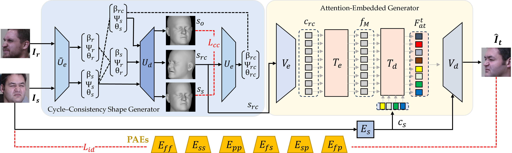

# Pose Adapted Shape Learning for Large-Pose Face Reenactment

> **Abstract:** We propose the Pose Adapted Shape Learning (PASL) for large-pose face reenactment. The PASL framework consists of three modules, namely the Pose-Adapted face Encoder (PAE), the Cycle-consistent Shape Generator (CSG), and the Attention-Embedded Generator (AEG). Different from previous approaches that use a single face encoder for identity preservation, we propose multiple Pose-Adapted face Encodes (PAEs) to better preserve facial identity across large poses.  Given a source face and a reference face, the CSG generates a recomposed shape that fuses the source identity and reference action in the shape space and meets the cycle consistency requirement. Taking the shape code and the source as inputs, the AEG learns the attention within the shape code and between the shape code and source style to enhance the generation of the desired target face. As existing benchmark datasets are inappropriate for evaluating large-pose face reenactment, we propose a scheme to compose large-pose face pairs and introduce the MPIE-LP (Large Pose) and VoxCeleb2-LP datasets as the new large-pose benchmarks. We compared our approach with state-of-the-art methods on MPIE-LP and VoxCeleb2-LP for large-pose performance and on VoxCeleb1 for the common scope of pose variation.


https://github.com/xxxxxx321/PASL/assets/151173571/88824fb8-fcaa-4035-a510-6e5cb1b9abd3


# Getting Started
- Clone the repo:
```
git clone https://github.com/AvLab-CV/PASL.git
cd PASL
```
# Installation
- Python 3.7
- Pytorch 1.12.1
2. Install the requirements
   ```
    conda env create -f environment.yml
    ```
3. Please refer to [Pytorch3d](https://github.com/facebookresearch/pytorch3d/blob/main/INSTALL.md) to install pytorch3d.

# Voxceleb2 LP Dataset
We offer the Voxceleb2 LP Dataset for download.
[GDrive](https://drive.google.com/drive/folders/1kHeXm9hOPCsF1Jyh9hVTqvPagYvvf-w8?usp=sharing)

# Training and Testing Lists 
We provide the training and testing lists for MPIE-LP and Voxceleb2, as well as the testing list for Voxceleb1.
[GDrive](https://drive.google.com/drive/folders/13yte5HkvXfZvToAN0jebS304Lj009rzo?usp=sharing)

# Demo Pretrained Model
|Demo Pretrained Model|
|---|
|[GDrive](https://drive.google.com/drive/folders/1yHrOIKB0cttrDxHeAN5Yh8KOjGy3CNHy?usp=sharing)|

Please place the checkpoint files in the `./experiment/demo` directory.

# Auxiliary Models
|Path|Description|
|---|---|
|[DECA model](https://drive.google.com/file/d/1oMwg5xzkgPkYiZT_ZUCwk7CdttEbubkD/view?usp=sharing)|Please unzip and place them in the main directory.|

# Inference
```
python demo_cam.py
python demo_video.py
python demo_ui.py
```
You can use `demo_cam.py` for a camera demo, or `demo_video.py` for a video demo. Additionally, we also offer a UI method using `demo_ui.py`.

# Validation
## Download the Test Lists.
Please download the test lists for each dataset. Note that you will need to change the paths accordingly.

## Validation Pretrained Models
The pretrained models for MPIE-LP, Voxceleb1, and Voxceleb2-LP can be downloaded from the following links.
|Pretrained Models|
|---|
|[MPIE-LP](https://drive.google.com/drive/folders/1LtU6YMu6OK2MI4d7s7pFiMJsEc7r_FN1?usp=sharing)|
|[Voxceleb1](https://drive.google.com/drive/folders/1QPcTccAXWvdpZGfm5knLZm_GkyBD9tZw?usp=sharing)|
|[Voxceleb2-LP]()|

Please place the models for different datasets in the `./experiment` directory.

## Generate the Test Samples
Next, You can use `test_sample_mpie.py`, `test_sample_vox1.py`, and `test_sample_vox2.py` to generate test samples for each respective dataset. The generated images will be placed in the `./expr/eval` directory.

```
python test_sample_mpie.py
python test_sample_vox1.py
python test_sample_vox2.py
```

## Use PAE and ArcFace to Test CSIM
After generating the test samples, you can use `mean_poe_csim.py` and `mean_arcface_csim.py` to test CSIM. Please download the PAE pretrained model and the ArcFace pretrained model from the following links, and extract them directly to start testing.

|Backbone|
|---|
|[PAE](https://drive.google.com/file/d/1zU1YTRstgrdJ7hwjl9CVjgFnNAyNFLZS/view?usp=sharing)|Unzip it and place it into the data directory|
|[ArcFace](https://drive.google.com/file/d/10RPCyfVHWuCOLb7RPN3YAJ0KnYITDCgZ/view?usp=sharing)|Unzip it and place it into the main directory|

```
python mean_pae_csim.py
python mean_arcface_csim.py
```
    
